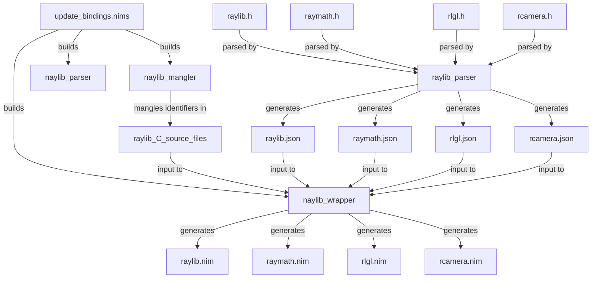
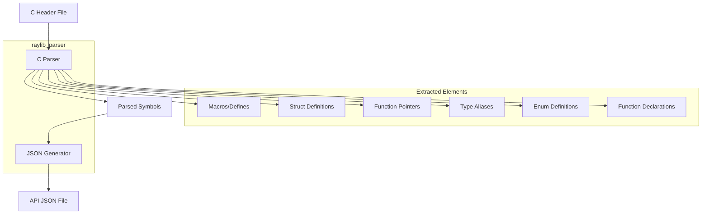
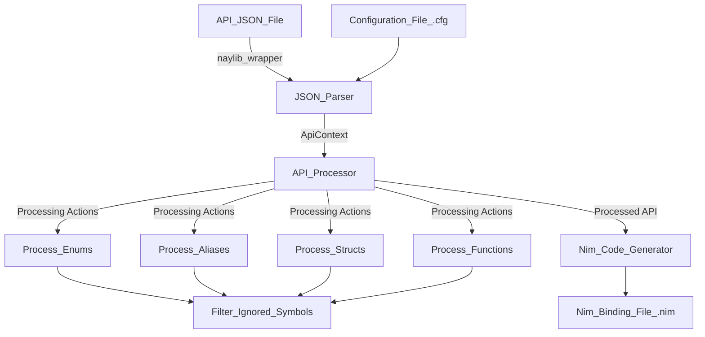
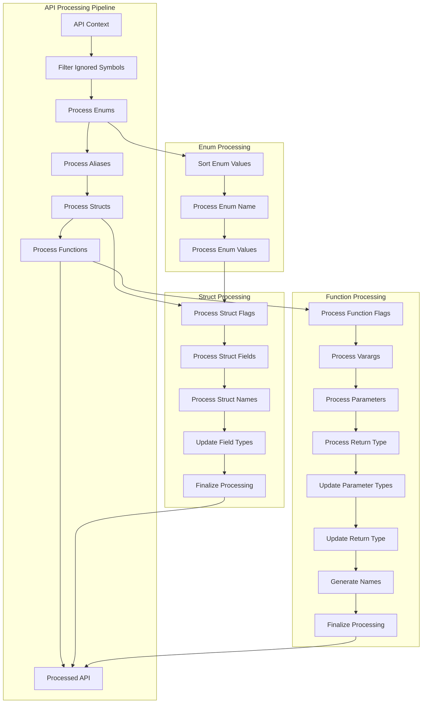

# Binding Generation and Tooling

## Purpose and Scope

This document explains the automated tooling system used to generate the Nim bindings for raylib in naylib. It covers the binding generation workflow, the tools involved, and how to customize the binding process. The documentation focuses on the technical aspects of how C headers from raylib are transformed into idiomatic Nim interfaces.

For information about using the generated bindings in your Nim application, see **Core Nim Bindings**.

---

## Binding Generation Architecture

Naylib uses a multi-stage binding generation system to create and maintain accurate Nim interfaces for the raylib C library. The system consists of three main tools and a coordinating script that automates the entire process.



The workflow operates as follows:
- The `update_bindings.nims` script coordinates the entire binding generation process.
- C header files from raylib are parsed by `raylib_parser` to extract API information.
- The extracted API information is saved as JSON files.
- These JSON files are processed by `naylib_wrapper` to generate Nim bindings.
- Optionally, `naylib_mangler` can mangle identifiers in the raylib C source code.

---

## Tools Description

### update_bindings.nims

The central script that orchestrates the binding generation process. This Nim script provides tasks for building the tools, generating API JSON files, creating Nim wrappers, updating raylib, and mangling identifiers.

| Task           | Description                                      |
|----------------|--------------------------------------------------|
| buildTools     | Builds the raylib_parser, naylib_wrapper, and naylib_mangler tools |
| genApi         | Generates API JSON files from raylib C headers   |
| genWrappers    | Generates Nim wrapper files from the API JSON files |
| update         | Updates the raylib git repository and copies the latest source |
| mangle         | Mangles identifiers in raylib source code        |
| wrap           | A comprehensive task that builds tools and produces all Nim wrappers |
| docs           | Generates documentation for the Nim bindings     |

---

### raylib_parser

A C tool that parses raylib header files and extracts API information. It outputs the extracted information as JSON files.



The parser identifies important elements in the C headers, such as:
- Function declarations (with parameter and return types)
- Struct definitions
- Enum definitions
- Type aliases
- Callback (function pointer) types
- Defines/macros

---

### naylib_wrapper

A Nim tool that processes the API JSON files and generates Nim bindings. It uses configuration files to customize the binding generation process.



The wrapper performs several important transformations:
- Removes namespace prefixes from symbols
- Converts C types to Nim types
- Processes function parameters and return types
- Handles special cases like out parameters and varargs
- Creates idiomatic Nim interfaces for C structs
- Generates automatic wrappers for functions with special handling needs

---

### naylib_mangler

A Nim tool that mangles identifiers in raylib source code. This is necessary in some cases to avoid conflicts or to adapt the C code for Nim's linking requirements.

---

## Binding Process in Detail

The binding generation process involves several transformations to convert C API definitions into idiomatic Nim code.



---

### Key Transformations

The processor performs various transformations on the API to make it more Nim-friendly:

- **Symbol Filtering:** Removes symbols that should be ignored based on configuration
- **Enum Processing:** Sorts enum values, removes prefixes, and normalizes names
- **Alias Processing:** Marks aliases as distinct types when necessary
- **Struct Processing:**
  - Marks structs as complete or private as needed
  - Processes struct fields (array detection, privacy flags)
  - Removes namespace prefixes from struct names
  - Updates field types to their Nim equivalents
  - Handles read-only fields by generating accessors
- **Function Processing:**
  - Marks functions as wrapped, private, or side-effect-free
  - Processes varargs parameters
  - Converts parameter types to Nim equivalents
  - Handles special cases like out parameters and open arrays
  - Generates idiomatic Nim names for functions

---

## Customization Options

The binding generation process can be customized through configuration files. Each module (raylib, raymath, rlgl, rcamera) has its own configuration file that controls how the bindings are generated.

| Option               | Description                                      |
|----------------------|--------------------------------------------------|
| namespacePrefix      | Prefix to remove from symbol names               |
| ignoredSymbols       | Symbols to exclude from the bindings             |
| mangledSymbols       | Symbols that have been mangled in the C source   |
| arrayTypes           | Types that should be treated as arrays           |
| privateSymbols       | Symbols that should be marked as private         |
| readOnlyFields       | Fields that should be read-only with accessor methods |
| outParameters        | Parameters that should be treated as output parameters |
| openArrayParameters  | Parameters that should be treated as open arrays  |
| typeReplacements     | C types to replace with specific Nim types        |
| wrappedFuncs         | Functions that require custom wrappers           |
| noSideEffectsFuncs   | Functions that have no side effects              |
| discardReturn        | Functions where the return value can be discarded |
| boolReturn           | Functions that return a boolean-like value       |

---

## Using the Binding Tools

### Updating Raylib and Regenerating Bindings

To update raylib to the latest version and regenerate the bindings:

1. Run the update task to fetch the latest raylib source:
   ```sh
   nim update_bindings.nims update
   ```
2. Run the wrap task to generate the bindings:
   ```sh
   nim update_bindings.nims wrap
   ```

This will:
- Fetch the latest raylib source code
- Build the necessary tools (parser, wrapper, mangler)
- Generate API JSON files from the headers
- Generate Nim bindings from the JSON files

---

### Customizing the Binding Process

To customize the binding process:
- Modify the configuration files in `tools/wrapper/config/`
- Run the wrap task to regenerate the bindings with your customizations

You might need to customize the bindings if:
- You need to exclude certain symbols from the bindings
- You need to change how certain types are mapped to Nim
- You need special handling for certain functions
- You want to make certain symbols private

---

## Best Practices

- Regenerate bindings when updating to a new version of raylib
- Use configuration files for customization rather than modifying the generated code
- Keep manual changes to a minimum; they will be lost when regenerating bindings
- If you need custom functionality, create wrapper functions rather than modifying the generated bindings
- Document any customizations you make to the binding process
